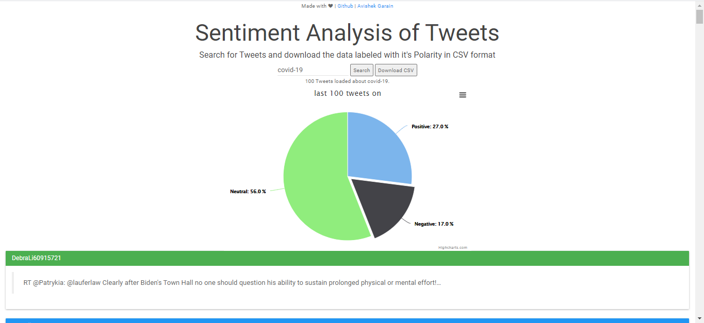

<script data-ad-client="ca-pub-7113951020114118" async src="https://pagead2.googlesyndication.com/pagead/js/adsbygoogle.js"></script>	
## Welcome to my Works
```
   ____   _                     _        _     _                            __        __         _            _                                  _                         _                              _     _                                    _   _   _ 
  / ___| | |__     ___    ___  | | __   | |_  | |__     ___   ___    ___    \ \      / /   ___  | |__        / \     _ __    _ __    ___      __| |   ___  __   __   ___  | |   ___    _ __     ___    __| |   | |__    _   _     _ __ ___     ___  | | | | | |
 | |     | '_ \   / _ \  / __| | |/ /   | __| | '_ \   / _ \ / __|  / _ \    \ \ /\ / /   / _ \ | '_ \      / _ \   | '_ \  | '_ \  / __|    / _` |  / _ \ \ \ / /  / _ \ | |  / _ \  | '_ \   / _ \  / _` |   | '_ \  | | | |   | '_ ` _ \   / _ \ | | | | | |
 | |___  | | | | |  __/ | (__  |   <    | |_  | | | | |  __/ \__ \ |  __/     \ V  V /   |  __/ | |_) |    / ___ \  | |_) | | |_) | \__ \   | (_| | |  __/  \ V /  |  __/ | | | (_) | | |_) | |  __/ | (_| |   | |_) | | |_| |   | | | | | | |  __/ |_| |_| |_|
  \____| |_| |_|  \___|  \___| |_|\_\    \__| |_| |_|  \___| |___/  \___|      \_/\_/     \___| |_.__/    /_/   \_\ | .__/  | .__/  |___/    \__,_|  \___|   \_/    \___| |_|  \___/  | .__/   \___|  \__,_|   |_.__/   \__, |   |_| |_| |_|  \___| (_) (_) (_)
                                                                                                                    |_|     |_|                                                       |_|                               |___/                                  
```
# Machine Learning Metrics Visualizer App

This is a machine learning metrics visualizer tool for binary and multi-class classification of data.
For Binary classification, Confusion Matrix, ROC Curve and Precision Recall curves can be visualized. 
For multi-class classification, only Confusion Matrix can be visualized.

## App link

[Link to app](https://garain.vision/Authentication/mlvisualize)

## Guidelines if facing problems to open site

The app uses one heroku dyno, so it faces loading issues sometimes. Once you go to the site, and it shows connecting, but doesn't open after 15 to 20s, then simply reload the site. Once it shows connecting, open some other pre-opened tab of the browser window. Then come back to the site after 5 to 6 secs. It will open by then.

## Algorithms supported

1. Support Vector Machine (SVM)
2. Logistic Regression
3. Random Forest
4. Nearest Neighbors
5. Decision Tree 
6. Neural Net(MLP)
7. AdaBoost(Decision Tree Classifier kernel) 
8. Naive Bayes
9. Quadratic Discriminant Analysis(QDA)

## Working
1. Upload a .csv file.
2. The 1st column should contain the labels and every column should have a header. 
3. Select any one of the algorithms.
4. Select hyperparameters according to your choice.
5. Select any one metric at a time to display. (Only one at a time)
6. Press classify.
7. The label column should have heading 'type'.

## Raw data
To view your data select "Show Raw data" option.

## Default
By default UCL mushrooms dataset is loaded.


# Clustering Methods
Made a new clustering algorithm based on K-Means algorithm published in Procedia Computer Science Journal named K-RMS Algorithm.
This is the web app created as an implementation of the publication "K-RMS Algorithm" that uses **Flask** and **Gunicorn** for deploying.
If we want to deploy our project to Heroku, we need a **Web Server Gateway Interface** (WSGI) such as **Gunicorn**.

## App link
[Link to app](https://garain.vision/Authentication/clusteringKRMS)

## Usage of the app
By default if any file with wrong file format is provided, the results shown as output are calculated on the Iris dataset.

Specificatons of the file:

1. 1st row should have data headings, i.e., column headings.
2. The last column should contain the corresponding data labels in an ascending order starting from index 1 (N.B. The number of clusters is calculated using this column.
3. File should be strictly in .csv format.
4. File size should be <=600 KB.

## Output
Dictionary with Accuracy and Clusters centroids alongwith a message showing number of iterations and lowest and highest errors.

## Publication details

### DOI
[https://doi.org/10.1016/j.procs.2020.03.188](https://doi.org/10.1016/j.procs.2020.03.188)

### Authors
Avishek Garain, Dipankar Das

### Bibtex

@article{garain2020k,
  title={K-RMS Algorithm},
  author={Garain, Avishek and Das, Dipankar},
  journal={Procedia Computer Science},
  volume={167},
  pages={113--120},
  year={2020},
  publisher={Elsevier}
}

### Harvard-style
Garain, A. and Das, D., 2020. K-RMS Algorithm. Procedia Computer Science, 167, pp.113-120.


# Stock Market Analyser

## Web app link

[Link to app](https://garain.vision/Authentication/stockanalyze)

## About the Project

Entering the appropriate company code and date range will fetch the company stock values.

Use the menus to plot the required plots according to the parameters available.

## Link to download stock codes

[https://investexcel.net/wp-content/uploads/2015/01/Yahoo-Ticker-Symbols-September-2017.zip](https://investexcel.net/wp-content/uploads/2015/01/Yahoo-Ticker-Symbols-September-2017.zip)

# Collision Data Visualizer Tool
This is a collision data visualizer tool for visualizing vehicle collision data in New York City.

## App link
[Link to app](https://garain.vision/Authentication/collisionvisualize)

## Notes
The app takes approx 10 to 15 seconds to load for the first time you open the app. Thereafter whenever you go to the link it runs smoothly and very fast, as the data files get cached in the browser. There is option to clear the cache. The visualization is for 10999 rows of data.

## Raw data
To view your data select "Show Raw data" option.

# Text2Image Converter
This app is capable of generating images from text in 4 formats with various types of customizations for the font with multi-lingual support.

## App Link
[Link to app](https://garain.vision/Authentication/text2image)

## Customizations

1. Font style
2. Background color
3. Bold & Italics
4. Font size
5. Height and Width
6. Text alignment in image
7. Shadow
8. Any language
9. Support for mathematical symbols

# Handwritten-and-Printed-Text-Classification-in-Doctors-Prescription 

Localization of Handwritten and Printed Text in doctors' prescription. It consists of two stages, first retrival of possible Text Regions in the prescriptions overcoming the challenges like lines, dotted lines and tables and finally classification of them using Machine Learning.

[Link to app](https://garain.vision/Authentication/prescription)

To run the GUI

First install the utilities:
```bash
$ sudo add-apt-repository main

$ sudo apt-get install python3.6

$ pip install Pillow

$ pip install opencv-python

$ pip install numpy

$ pip install pandas

$ pip install sklearn

$ pip install joblib

$ pip install pickle-mixin

$ pip install pdbpp
```
Then run the script
```bash
$ python3 tkinteropen.py
```
Keep the data.joblib in the same directory with the tkinteropen.py

# Weather Forecast App

## Introduction
Get your weather information just by click of a button.

[Link to app](https://garain.vision/Authentication/weatherForecast)

## Working
It gives precise weather information by making use of ip information. It takes approx time ranging from 1s to 10s depending on network speed.

## Facilities

1. Precise weather information.
2. Fast and lightweight.
3. Responsive giving 3-day forecast for smartphones and 7-day forecast on PCs.
4. Responsive widget with realtime change in graphics based on weather.


# GitSub

#### Create GitHub Resource Download Link

With this tool you can directly download or create download link to any GitHub **public directory or file**.

### Website

[GitSub ↑](https://garain.vision/Authentication/gitsub)

##### Advanced Usage

A typical download URL will look like this- `https://gitsub.garain.vision/#/home?url=<link>&fileName=<name>&rootDirectory=<true or false or name>`

Now, if you want to download this directory- **`https://github.com/garain/GitSub/tree/master/res/images`** with this file name- **`DownGit-Images.zip`** and this root directory name- **`ImagesOfDownGit`**, then the URL will be- https://gitsub.garain.vision/#/home?url=https://github.com/garain/GitSub/tree/master/res/images&fileName=DownGit-Images&rootDirectory=ImagesOfDownGit

In default, value of `fileName` and `rootDirectory` is set to the name of the downloading file or directory. If you do not want to add the directory itself in the zip, then set `rootDirectory=false`. Like: this link- https://gitsub.garain.vision/#/home?url=https://github.com/garain/GitSub/tree/master/res/images&rootDirectory=false, will download a file named **`images.zip`**; however the root directory- `"images"`, will not be included in the zip.

If you want to download file- **`https://github.com/garain/GitSub/blob/master/res/images/downgit.png`** with name- **`DownGitIcon.zip`**, then the link will be- https://gitsub.garain.vision/#/home?url=https://github.com/garain/GitSub/blob/master/res/images/downgit.png&fileName=DownGitIcon

### License
<a rel="license" href="https://opensource.org/licenses/MIT"></a><br/><a href="https://github.com/garain/GitSub">DownGit</a> is licensed under <a rel="license" href="https://opensource.org/licenses/MIT">MIT License</a>.

# Tweet Sentiment Analyzer

Search for Tweets and download the data labeled with it's Polarity in CSV format.

View Live at [https://twitter-sentiment-analyze.herokuapp.com/](https://twitter-sentiment-csv.herokuapp.com/)



## Notes

1. At max 100 tweets are returned for each query due to twitter rate limit.
2. All the tweets are the latest tweets.
3. Sentiment labelling is done using TextBlob.


## [License MIT © Avishek Garain](https://rhnvrm.mit-license.org/)


# Voice Note App
### Converting from Speech to Text with JavaScript

The purpose of this app is to experiment with the Web Speech API which enables you to incorporate voice data into web apps. The Web Speech API has two parts: SpeechSynthesis (Text-to-Speech), and SpeechRecognition (Asynchronous Speech Recognition.)

This app uses the Web Speech API to build a voice powered note app to do 3 things:

 - Takes notes by using voice-to-text or keyboard input.
 - Save voice notes to localStorage.
 - Display all of the saved notes and give the option to either Listen to the Notes or delete them.


<!---->
<br>

[Link to App - Click Here](https://garain.vision/Authentication/voicenotes) - __Best Used with Chrome__

__Note:__ On Chrome, using Speech Recognition on a web page involves a server-based recognition engine. Your audio is sent to a web service for recognition processing, so it won't work offline.
<br>

Most APIs that require user permission don't work on non-secure hosts. Make sure you are serving your Web Speech apps over HTTPS.
<br>

----

### Table of Contents

  -  Description
  -  What I Learned From The Exercise
  -  Website Technologies Used
  -  How to Use This App
  -  File and Directory Structure
  -  Resources
  -  Revision History  
<br>

----


### Description

The Web Speech API provides two distinct areas of functionality — speech recognition, and speech synthesis (also know as text to speech, or tts) 

The Voice Note App will be separated into two seperate interfaces. The first will be the __"Speech Recognition"__ that will involve receiving speech through a device's microphone, which is then checked by a speech recognition service against a list of grammar (basically, the vocabulary you want to have recognised in a particular app.) When a word or phrase is successfully recognised, it is returned as a result (or list of results) as a text string, and further actions can be initiated as a result.

The second is __"Speech Synthesis"__ (aka text-to-speech, or tts) that involves receiving synthesising text contained within an app to speech, and playing it out of a device's speaker or audio output connection.
<br>


----


### What I Learned From The Exercise
- To work with the Web Speech API; speech recognition, and speech synthesis.
<br>

----


### Website Technologies Used

Description of website technologies used to develop this app.

- HTML
- CSS
- JavaScript
- Bootstrap
- Web Speech API
<br>

----


### How to Use This App

### Add A New Voice or Text Note
1. ​Click on the Start Recognition Button and give the app permission to use your microphone, and start speaking your note (if no microphone or you don't want to use the microphone you can type into the text box.)

2. ​When done speaking click on the "Pause Recognition" button, and then click the "Save Note" button. (if you you typed your note in to the text box you do not need to click on the "Pause Recognition" button, just click the "Save Note" button.) 
<br>

----

### Listen To Notes
1. Click on the "Listen to Note" link next to the date of the note that you want to listen to.
<br>

----

### Delete Voice Notes
1. Click on the "Delete" link next to the date of the note that you want to delete.
<br>

----


 - __Best Used with Chrome__

__Note:__ On Chrome, using Speech Recognition on a web page involves a server-based recognition engine. Your audio is sent to a web service for recognition processing, so it won't work offline.
<br>

Most APIs that require user permission don't work on non-secure hosts. Make sure you are serving your Web Speech apps over HTTPS.
<br>


----

### File and Directory Structure

```
.
├── assets
│   │
│   ├── css
│   │   │
│   │   └── style.css
│   │
│   ├── ico
│   │   │
│   │   └── favicon.ico
│   │
│   ├── img
│   │   │
│   │   ├── code-mic-150.png
│   │   │
│   │   └── voice.jpeg
│   │
│   └── js
│       │
│       └── script.js
│ 
├── .gitignore
│
├── index.html
│
└── README.md     
       
```

----


### Resources

Article from [tutorialzine Converting from Speech to Text with JavaScript](https://tutorialzine.com/2017/08/converting-from-speech-to-text-with-javascript) using HTML, CSS, [jQuery](https://jquery.com/), JavaScript, and [Shoelace.css](https://shoelace.style/index.html) a lightweight, forward-thinking CSS library built with future CSS syntax.
 
Reference how to work with the Web Speech API - [MDN Web Docs Web Speech API](https://developer.mozilla.org/en-US/docs/Web/API/Web_Speech_API)
<br>

----


# Contact

<a href="https://www.linkedin.com/in/avishek-garain-2b5369152/"></a> <a href="https://www.github.com/garain/"></a> <a href="https://scholar.google.com/citations?user=ESDY-skAAAAJ&hl=en"></a> <a href="https://www.facebook.com/avishek.garain.1"></a> <a href="https://www.twitter.com/GarainAvishek"></a> <a href="cv_avishek_garain.pdf" download></a> 

<script async src="https://pagead2.googlesyndication.com/pagead/js/adsbygoogle.js"></script>
<!-- Ad1 -->
<ins class="adsbygoogle"
     style="display:block"
     data-ad-client="ca-pub-7113951020114118"
     data-ad-slot="1592829567"
     data-ad-format="auto"
     data-full-width-responsive="true"></ins>
<script>
     (adsbygoogle = window.adsbygoogle || []).push({});
</script>
